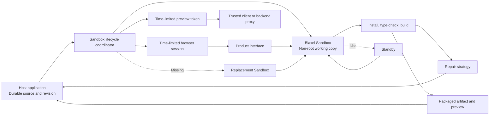

# Architecture

The host application owns durable product state. The Sandbox owns the replaceable working environment.

## Responsibility boundary

| Concern | Host application | Blaxel execution layer |
| --- | --- | --- |
| Durable source and revision | Owns and saves | Receives a projected working copy |
| Product model and user interface | Owns | Does not replace |
| Sandbox creation and identity | Chooses project identity and policy | Creates or reconnects by deterministic name and records the external ID mapping |
| File and process operations | Invokes through the SDK or a scoped browser session | Executes inside the Sandbox |
| Code repair | Chooses the agent or model strategy | Returns process output used by the strategy |
| Build artifact | Receives and stores | Produces in the isolated working environment |
| Preview | Authorizes the product user | Routes the process and enforces preview-token access |
| Standby and resume | Releases and reconnects | Retains Sandbox state while the environment exists |
| Replacement | Re-projects the latest durable revision | Provides the new working environment |

## Environment and component identity

Map one host-owned project or application environment to one Sandbox. Keep generated component IDs inside that environment's source tree. Components mapped to the same Sandbox can share files, dependencies, build tools, and preview processes across successive operations.

This mapping does not coordinate concurrent writers. If several agent operations can change the same environment at once, the host application must serialize them or add distributed ownership and idempotency before it projects a new revision.

## Request sequence

1. The host loads the latest project revision.
2. The coordinator derives a deterministic Sandbox name and uses the project ID as the external ID.
3. The coordinator reconnects to that Sandbox.
4. A missing Sandbox is created with an idle expiration policy and the reviewed non-root image.
5. The host revision is compared with `.cookbook-revision` in the working directory.
6. A missing or stale revision causes a complete source projection. Small trees use `writeTree`; larger trees use a ZIP upload and extraction step.
7. Dependency installation runs without package lifecycle scripts. The custom image runs workload operations as a non-root user.
8. Commands longer than the synchronous wait ceiling start asynchronously and are observed through `process.wait`.
9. A nonzero process exit becomes a code failure with stdout and stderr attached.
10. The repair strategy produces a new host revision, which is saved before it is projected.
11. A successful build is packaged and downloaded to the host artifact store.
12. The preview process starts without process keep-alive.
13. The backend creates a private preview token and a time-limited Sandbox session.
14. A trusted client or backend proxy sends the preview token in the documented header. The browser demo runs its preview proxy on a separate origin, pins upstream requests to the preview origin, rejects redirects, and uses its Sandbox session only for filesystem operations. Workspace credentials remain on the backend.

## Lifecycle invariants

1. The host revision is the recovery source of truth.
2. A Sandbox working copy can be replaced without losing the latest saved revision.
3. A code failure does not trigger Sandbox replacement.
4. An application-origin path or routing error does not trigger Sandbox replacement.
5. Temporary workload unavailability receives the full bounded retry window before replacement.
6. A missing workload can be recreated immediately.
7. A repaired revision is saved by the host before a new build starts.
8. The compiled artifact leaves the Sandbox and is stored by the host.
9. Workspace credentials do not enter the browser or generated code.
10. Preview and session credentials are time-limited and scoped to one Sandbox.
11. Projected file paths cannot be absolute or escape the working directory.
12. Generated code runs as the non-root workload user in the supplied image.
13. Expiration is an application-selected cleanup policy, separate from standby. The host revision remains the recovery source if the policy deletes a Sandbox.

## Why the execution layer is separate

The alternative architecture would require the product team to combine isolated compute, file APIs, process APIs, preview routing, browser access tokens, retained working state, expiration, and structured recovery signals around generic compute.

This cookbook keeps that integration behind one runtime adapter. The application can spend its engineering effort on source semantics, repair behavior, authorization, and the product experience while the execution lifecycle remains a replaceable infrastructure layer.

## V1 boundary

The local `FileProjectStore` represents the host product database. It is intentionally small and should be replaced with the application’s durable store.

The Sandbox lifecycle coordinator runs in one process. A multi-instance service needs distributed ownership or idempotency around build and replacement operations. The idle expiration policy is a cleanup backstop, not confirmation that explicit cleanup completed.
